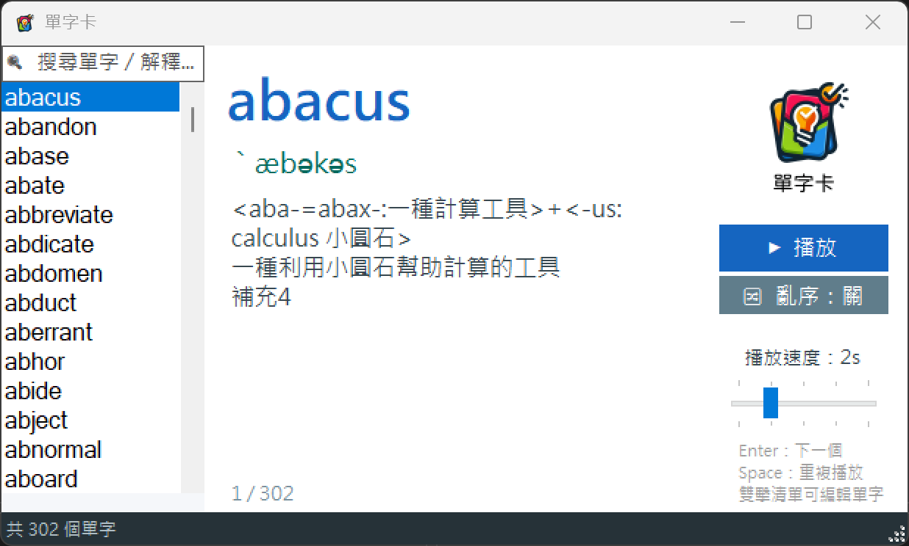
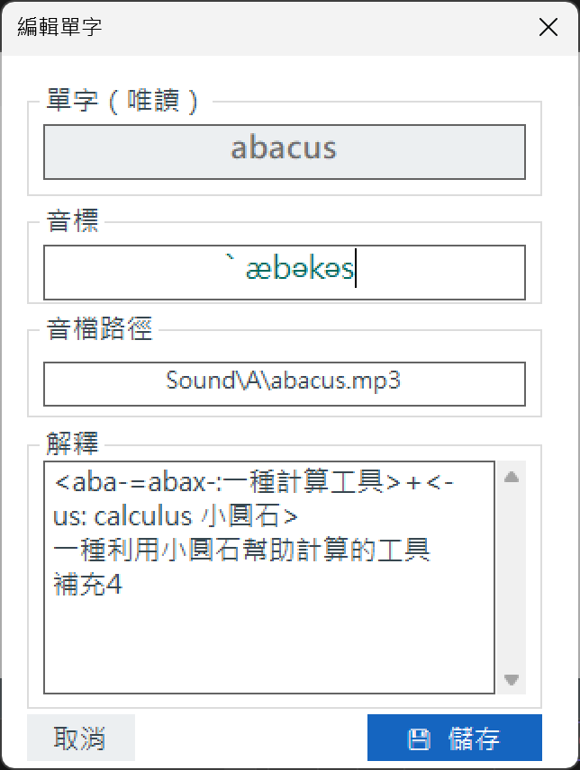

# 🔊 WordCards 單字卡學習工具

一個以 C# Windows Forms 製作的單字卡（字卡）學習輔助工具，可讀取 TSV 格式的單字資料檔，支援單字發音播放、自動連續播放、即時搜尋、亂序練習與單字編輯。

## 📸 截圖

**主畫面**


**速度調整**


## ✨ 功能

- **🔊 單字發音**：點選單字即自動播放對應 mp3 音檔，並顯示音標與解釋
- **▶️ 自動播放**：一鍵連續播放整份清單，搭配計時器自動切換下一個單字
- **⏱️ 播放速度調整**：以拉桿（TrackBar）設定每個單字的停留秒數
- **🔍 即時搜尋**：輸入關鍵字可同時搜尋單字與解釋，清單即時更新
- **🔀 亂序練習**：一鍵開啟／關閉亂序（Fisher-Yates 洗牌），加強記憶
- **✏️ 單字編輯**：雙擊清單項目即可編輯單字、音標、解釋，並自動存回檔案
- **⌨️ 鍵盤操作**：`Enter` 下一個單字並發音、`Space` 重播目前單字
- **📊 進度與狀態列**：即時顯示目前進度（如 `12 / 350`）與單字總數／篩選筆數

## 🛠️ 開發環境

| 項目 | 版本 |
|------|------|
| 語言 | C# |
| 框架 | .NET Framework 4.7.2 |
| UI | Windows Forms |
| 播放 | Windows Media Player (WMPLib) |
| IDE | Visual Studio 2022 |

## 🚀 執行方式

1. 以 Visual Studio 開啟 `WordCards.sln`
2. 建置專案（Build → Build Solution）
3. 執行（F5 或 Ctrl+F5）
4. 程式啟動時會自動讀取執行目錄下的 `WordCards.txt` 單字檔

> ⚠️ 程式啟動時若找不到 `WordCards.txt` 會跳出錯誤並結束，請確認單字檔與音檔位於正確路徑。

## 📁 專案結構

```
WordCards/
├── Images/
│   ├── sample.png              # 主畫面截圖
│   └── adjust.png              # 速度調整截圖
├── WordCards/
│   ├── frmWordCards.cs         # 主要邏輯（播放、搜尋、亂序、鍵盤操作）
│   ├── frmWordCards.Designer.cs # 主畫面 UI 控制項配置
│   ├── frmEditWord.cs          # 單字編輯視窗
│   ├── frmEditWord.Designer.cs # 編輯視窗 UI 配置
│   ├── WordItem.cs             # 單字資料模型
│   ├── WordCollection.cs       # 單字集合類別（載入／儲存）
│   ├── Program.cs              # 程式進入點
│   ├── WordCards.txt           # 單字資料檔（UTF-8 / Tab 分隔）
│   ├── Sound/                  # 單字音檔（依字母分資料夾）
│   └── Properties/
└── WordCards.sln
```

## 📋 單字檔格式

每行一筆單字，欄位以 **Tab（`\t`）** 分隔：

```
單字	音標	音檔路徑	解釋1	解釋2	...
```

| 欄位 | 說明 |
|------|------|
| 單字 | 英文單字 |
| 音標 | KK 音標 |
| 音檔路徑 | 音檔相對路徑（如 `Sound\A\apple.mp3`） |
| 解釋 | 一或多欄，多欄會自動以換行合併顯示 |

**範例：**

```
abandon	əˋbændən	Sound\A\abandon.mp3	<ab-:away>+<-band:bind綁>	ban 禁令	把自己都放棄掉
```

## 📖 使用說明

1. 啟動程式後會自動載入 `WordCards.txt`，清單顯示所有單字
2. **點選**任一單字即可發音，並在右側顯示音標與解釋
3. 按「**▶ 播放**」開始自動連續播放，再按一次（或點清單）即停止
4. 拖曳**速度拉桿**調整每個單字的停留秒數
5. 按「**🔀 亂序**」切換亂序開／關，重新排列練習順序
6. 在**搜尋框**輸入關鍵字，可同時過濾**單字**與**解釋**
7. **雙擊**清單項目可編輯該單字，儲存後自動寫回 `WordCards.txt`
8. 鍵盤：`Enter` 跳到下一個單字並發音、`Space` 重播目前單字

## 📄 授權

本專案採用 [MIT License](LICENSE.txt) 授權。
